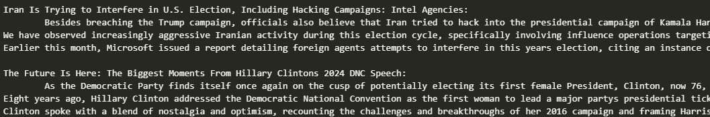
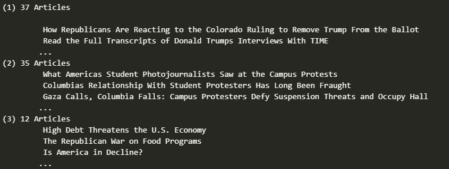
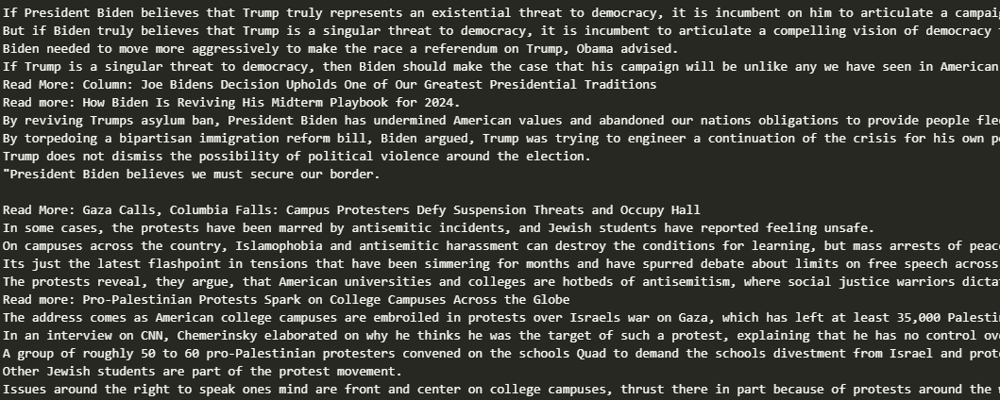
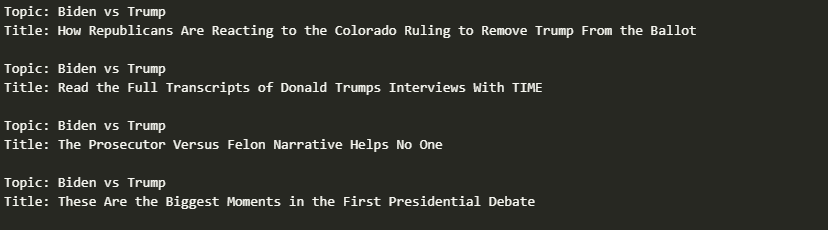
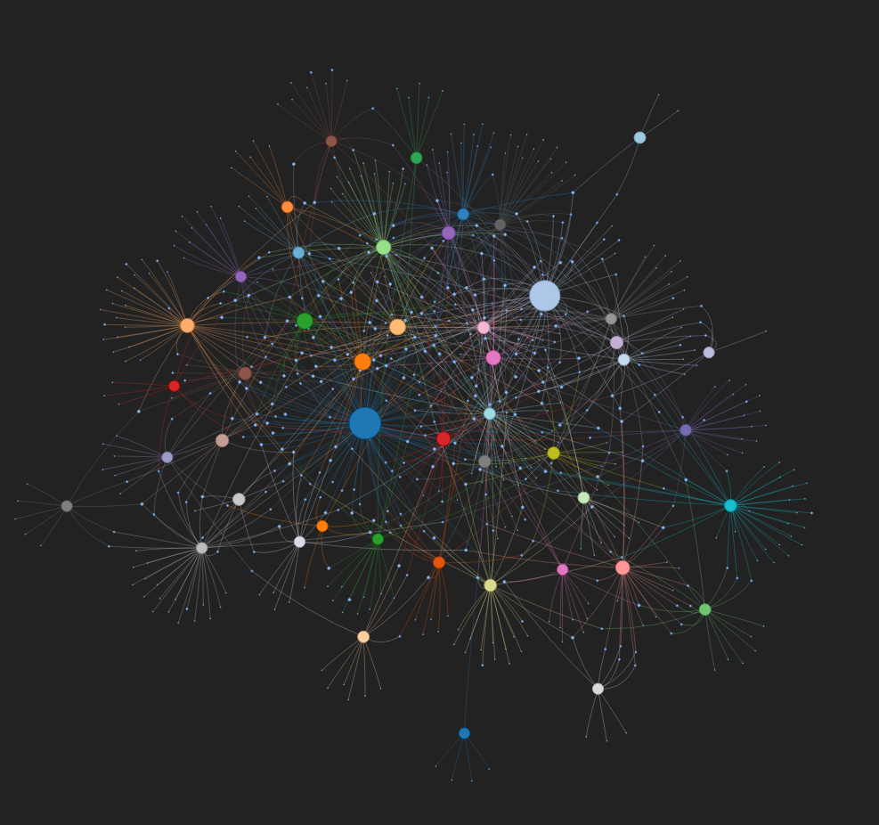
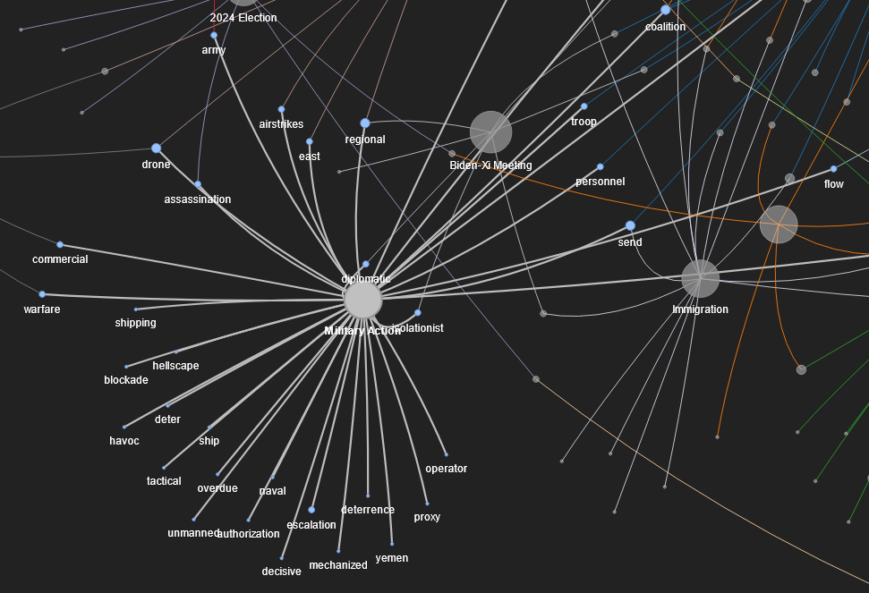
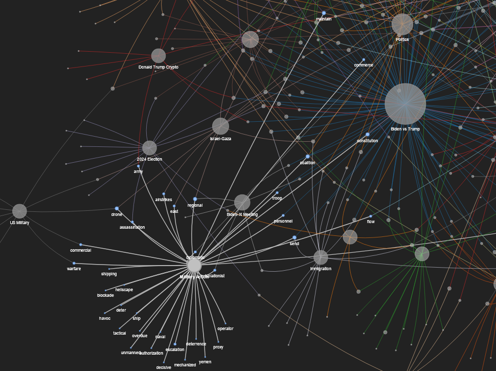

# MSDS DS Tools Final Project Paper - Topic Clustering And Visualization
By Garret Sugarbaker
## Motivation
Topic/semantic clustering is extremely important for working with large NLP datasets. It can be used for extracting relevant information, performing analytics on language data, and so much more. Tagging data with semantics provides the ability to aggregate NLP data which is typically unstructured and difficult to develop insights from.
## Dataset
For this experiment, news articles are scraped from [Time.com](https://time.com). The following information is collected for each article:
* Title: the header of the article
* URL: where the article is located
* Content as a list of paragraphs: what was written

The web scraping is done using the `requests` and `pyquery` libraries and is rate limited.

## Problem Definition
The goal for this project was to identify topics present in news articles and cluster them based on these. The data would then be visualized by relating each topic to the keywords related to it. NLP data is vast and difficult to aggregate so visualization approaches are limited.\
I chose to approach topic identification and clustering in an unguided way. This is because news have a relatively infinite number of possible topics, especially when getting more specific. Normally topics would be defined beforehand or seeded and since I was not interested in a certain specificity in the topics I did not have an interest in these approaches.\
The final goal was to have the articles grouped by topic, with the human readable topic tagged, and a visualization showing the relation between topics according to relevant keywords. 

## Existing Approaches
Semantic clustering and topic identification have been done using many methods. Some noteable approaches of include what is written in the following libraries:
* [Top2Vec](https://github.com/ddangelov/Top2Vec): Topic clustering and identification
* [gensim (Doc2Vec)](https://radimrehurek.com/gensim/): Topic clustering
* [sentencetransformers](https://sbert.net/): Semantic clustering
* [BERTopic](https://maartengr.github.io/BERTopic/index.html): Topic clustering and identification

These libraries provide tools but are not necessarily out-of-the-box approaches.\
`Top2Vec` for instance can both cluster and identify topics in text or documents but is ultimately built on `gensim` and `BERTopic`. These libraries depend on seeded or pre-defined topics for identification. For this project I wanted an unguided approach to topic identification that would be suitable for relatively unknown data.\
`sentencetransformers` is less tailored towards topics and instead provides tools for getting text embeddings and performing common operations on these embeddings. I used some of these functionalities in my approach.

There is also the option of using an LLM for summarization and topic identification. Because the text in this data is lengthy and I was interested in shared topics, an approach using an LLM independently would be costly and token limits for models would likely be exceeded. I used an LLM for topic identification but summarization was approached in a more cost effective way.

## Data Cleaning / Processing
The first step of data cleaning for this project was to normalize and filter the tokens within each article.
This was done as follows:
* Removing numbers
* Removing stopwords
* Lemmatizing tokens
* Removing words used only a single time
* Removing named-entities (ex: Jerry, Washington)
* Lowercasing words

Next data needed to start being prepared for the LLM to tag topics. The basic overview as as follows:
* Summarize each article with a `sentencetransformers` implementation of `LexRank`
* Cluster articles according to summary embeddings with `sentencetransformers`
* Summarize each cluster with the same implementation of `LexRank`

For the first summarization step embeddings were generated with `sentencetransformers` and ranked by relevance with `LexRank`. The top sentences were extracted to form a summary in the form of quoted text. It is important to note that no generative approaches were used for summarizing so each summary is a paraphrase of the original article with no new text.

Some summaries:\

These paraphrased sentences form a basic summary of the article using the most important sentences. These sentences are packed with information and give a good idea of the content of the article.

In order to cluster the articles, communities are detected using `sentencetransformers` again using criteria for minimum articles per cluster and minimum relevance between articles.

Some clusters, notice they are not tagged with a topic:\

A brief look at the clusters appears to confirm that they are related subjects. Using only the titles, it is not always obvious what the shared theme is however.

To summarize the clusters, the summaries for each article in the cluster are divided into sentences again and sent through `LexRank` once more. This was done in contrast to using the original article content to guarantee equal representation of each article in the `LexRank` process.

The final result is a list of article clusters that are each tagged with some paraphrased sentences that "summarize" it. The clusters are ready to be tagged with a topic.

Some cluster summaries:\

The cluster summaries are paraphrased again but paint a much clearer picture of what is being discussed across the articles. These will be much more useful in determining topics than the collective text of all the articles.

To assign topics to each cluster, I used `Llama 3.1 70B` with a custom system prompt intended for finding and outputting a topic that is shared in the input in a couple words. This was done locally using `Ollama` and took quite a bit of time.

Some articles tagged with topics:\

We can see these topics are appropriate for the articles and not always immediately evident from the title of the article.

It is interesting to note that I removed named entities from the original tokens that were used for summarization/clustering but they were still present in the text of the summaries. Llama found many topics that center around these named entities as a result. Removing the named entities was done to prevent confusion in `sentencetransformers` and reduce the total token count significantly but the timing of this removal would be an interesting subject for future experimentation. Additionally Llama could be provided with the same tokens instead of summaries for topic identification. All of this takes lots of time so I am leaving it here for now.

## Visualization
I chose to do a single visualization for this project as it can be difficult to display NLP in ways that are not misleading. The data was visualized as a network graph connecting topics to the keywords most important to them. This importance was decided in a somewhat nuanced way.\
First, a keyword could only be present in 3 clusters at most, otherwise it would be too common to be meaningful. Next, a keyword must have been present in 75% of the articles within the cluster. This way words are certainly relevant to the given topic.\
Keywords needed to be filtered carefully in order to make a graph that is readable but also contains enough information to be useful. ~5300 keywords were present after filtering the tokens from the 500 articles. This was far too much to visualize.

Here is what the network graph looks like at a distance. It is created with `pyvis` and allows for an interactive in-browser view of the network.\

Individual topic and keyword nodes can be selected to drill down on their connections. When a topic is selected, its ancestor topics remain grayed out but have their labels shown. This allows for lots of data exploration do be done in a single visualization.\

We can see the "Military Action" is connected to lots of relevant keywords like "drone", "isonlationist" and "warfare". The size of the topic nodes relates to its relative proportion of the provided articles. The exact number of these isn't important for the sake of this problem.

Looking at the connected nodes to "Military Action" we can see other topics that use similar keywords. This is less important to the overall problem but provides interesting insights into the type of language used across these subjects.\

We can see lots of shared keywords between the "Military Action" and "Biden vs. Trump" topics. This makes a lot of sense. On top of this, "Military Action" is connected to other topics like "Immigration", "2024 Election", "Biden-XI Meeting", and "Israel Gaza".

The main points of this visualization are showing the relative count of articles in each topic and giving an idea of the subject with the keywords associated with it. It would be pretty difficult to document it further here so instead, check out [the visual itself](./net.html) by opening the HTML file in your browser.
